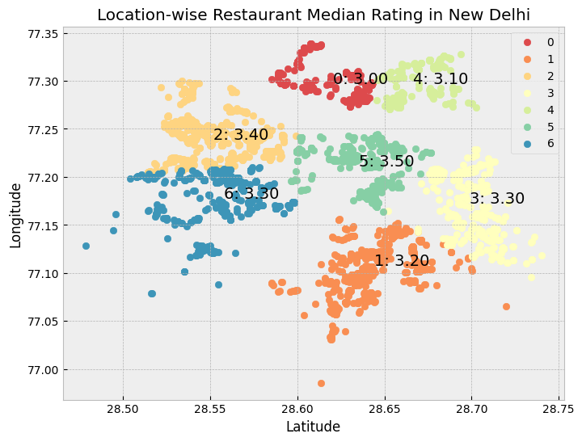

# Mood-Based Food Recommender

A Python project that explores the relationship between mood, food preferences, and restaurant choices. The project uses survey-based food preference data and restaurant data from New Delhi to identify food patterns associated with different moods and recommend relevant cuisine options.

---

## Project Overview

Food choices are often influenced by emotions and daily situations. This project analyzes food preference data to identify foods commonly associated with different moods and connects them with restaurant cuisine information.

The project also examines restaurant locations and ratings in New Delhi using clustering techniques to understand how restaurant quality varies across different areas.

---

## Dataset

### 1. Food Choices Dataset
Contains survey responses related to:

- Comfort foods
- Eating habits
- Food preferences
- Situational food choices

### 2. Zomato Restaurant Dataset
Contains restaurant information such as:

- Restaurant names
- Cuisines
- Ratings
- Votes
- Latitude and longitude
- Location details

---

## Objectives

- Analyze food preferences associated with different moods.
- Identify commonly preferred comfort foods.
- Match food preferences with restaurant cuisines.
- Study restaurant rating patterns across New Delhi.
- Group restaurants by location using clustering.

---

## Technologies Used

- Python
- Pandas
- NumPy
- Matplotlib
- Seaborn
- Scikit-learn
- NLTK
- Jupyter Notebook

---

## Project Workflow

### Data Preparation

- Load food preference and restaurant datasets
- Clean missing and inconsistent values
- Prepare text-based food preference data

### Food Preference Analysis

- Extract comfort food preferences
- Analyze foods associated with different moods
- Identify frequently occurring food categories

### Restaurant Analysis

- Analyze cuisine distribution
- Examine restaurant ratings
- Study restaurant locations

### Location Clustering

- Apply K-Means clustering on restaurant coordinates
- Group restaurants into location clusters
- Calculate median ratings for each cluster

### Visualization

- Cuisine distribution plots
- Rating analysis plots
- Cluster visualization using latitude and longitude

---

## Results

### Mood-Based Food Insights

The analysis identifies foods commonly preferred during situations such as:

- Stress
- Boredom
- Happiness
- Hunger
- Cold weather
- Watching television

### Restaurant Location Analysis

Restaurants are grouped into clusters based on geographic coordinates.

For each cluster:

- Median rating is calculated
- Rating differences between areas are compared
- Location patterns are visualized

Example output:



---

## Project Structure

```text
├── Mood_Based_Food_Recommender.ipynb
├── food_choices.csv
├── zomato.csv
├── rating_result.png
└── README.md
```

---

## Installation

Clone the repository:

```bash
git clone https://github.com/your-username/mood-based-food-recommender.git
cd mood-based-food-recommender
```

Install required packages:

```bash
pip install pandas numpy matplotlib seaborn scikit-learn nltk
```

---

## Running the Project

Launch Jupyter Notebook:

```bash
jupyter notebook
```

Open:

```text
Mood_Based_Food_Recommender.ipynb
```

Run all cells in sequence.

---

## Limitations

- Recommendations are based on available survey responses.
- Restaurant data is limited to the provided dataset.
- Results focus only on restaurants in New Delhi.
- Recommendations are cuisine-based and not personalized to individual users.

---

## Future Work

- Add a user interface for mood selection.
- Include additional restaurant datasets.
- Improve recommendation logic using user feedback.
- Consider factors such as cost, reviews, and restaurant type.

---

## Author

Developed as a data analysis project exploring food preferences, restaurant data, and location-based rating patterns.
